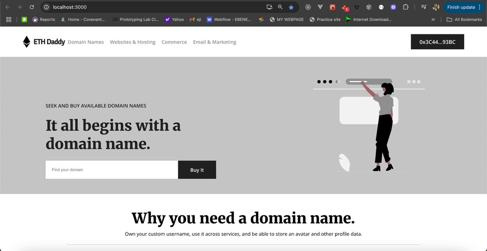
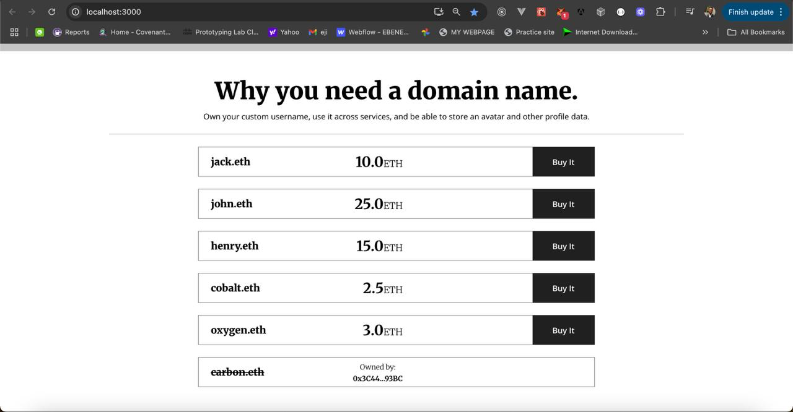

# ETH Daddy 

ETH Daddy is a lightweight, ENS-style domain marketplace dApp. It showcases a full stack Web3 flow—Solidity smart contracts (listing and purchasing domains), Hardhat for local development/testing, and a React frontend powered by Ethers for on-chain reads/writes. The deploy script seeds example domains (e.g., jack.eth, john.eth) with prices, and the UI lets users connect a wallet, browse available domains, and buy them with ETH. Ownership and listings are recorded on-chain, making this a solid reference for learning contract interactions, provider/network handling, and building a simple marketplace experience.

Features
On-chain registry and marketplace for human-readable .eth-style domains

Pre-seeded sample listings via deploy script for quick demos

Wallet connect, network detection, and live contract reads (e.g., supply, domain data)

Example tests and local workflow with Hardhat

Note: This project is a learning/demo implementation and not affiliated with ENS.

## Technology Stack & Tools

- Solidity (Writing Smart Contracts & Tests)
- Javascript (React & Testing)
- [Hardhat](https://hardhat.org/) (Development Framework)
- [Ethers.js](https://docs.ethers.io/v5/) (Blockchain Interaction)
- [React.js](https://reactjs.org/) (Frontend Framework)

## Snapshots

## Requirements For Initial Setup
- Install [NodeJS](https://nodejs.org/en/)

## Setting Up
### 1. Clone/Download the Repository

### 2. Install Dependencies:
`$ npm install`

### 3. Run tests
`$ npx hardhat test`

### 4. Start Hardhat node
`$ npx hardhat node`

### 5. Run deployment script
In a separate terminal execute:
`$ npx hardhat run ./scripts/deploy.js --network localhost`

### 7. Start frontend
`$ npm run start`